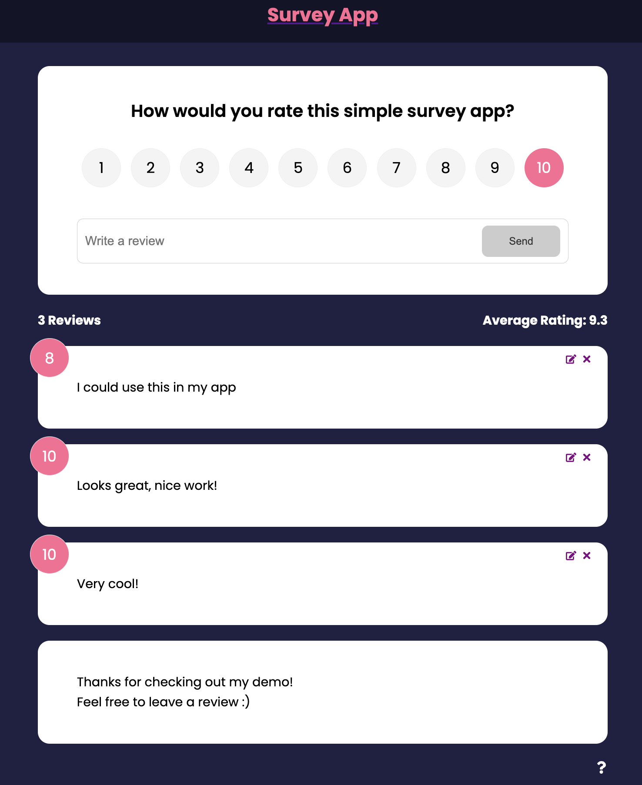

# Simple Survey App

A modern and dynamic survey application built with React and Firebase. It leverages Framer Motion for animations and is deployed on Netlify. During development, it uses JSON Server for mocking a backend and Concurrently for running multiple npm scripts simultaneously.

## Features

- Dynamic survey forms generated in React.
- Real-time data persistence with Firebase.
- Smooth animations with Framer Motion.
- Local backend simulation with JSON Server.
- Efficient task management in development with Concurrently.

## Getting Started

### Prerequisites

- Node.js and npm installed.
- Firebase account and a new project setup.

### Installation

1. Clone the repository:
   ```bash
   git clone https://github.com/CodingHobo/survey-app.git
    ```
2. Navigate to the project directory:
```bash
cd survey-app

```
3. Install required dependencies:
```
npm install
```
4. Set up your Firebase configuration and environment variables in a .env file. Make sure variable names start with REACT_APP_.

5. Run in your local server:
```bash
npm start
```
## Built With

- [React](https://reactjs.org/) - The web framework used.
- [Firebase](https://firebase.google.com/) - Backend and real-time database.
- [Framer Motion](https://www.framer.com/api/motion/) - Animation library.
- [Netlify](https://www.netlify.com/) - Deployment platform.
- [JSON Server](https://github.com/typicode/json-server) - Mock backend in development.
- [Concurrently](https://www.npmjs.com/package/concurrently) - Run multiple npm scripts simultaneously.

## Contributing

Contributions are welcome!

## License

[MIT](https://choosealicense.com/licenses/mit/)
